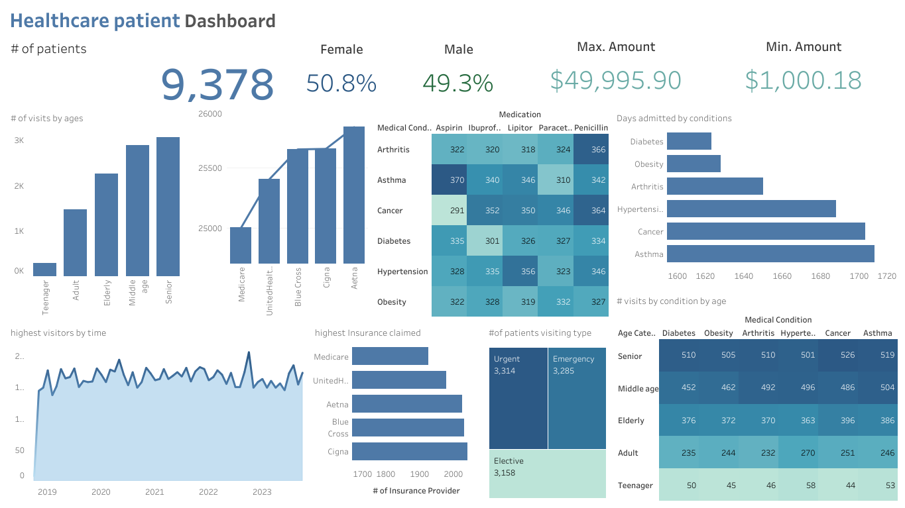
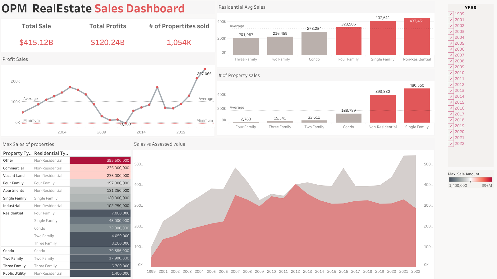

# Data Analyst    

###  SQL Server | Python | Tableau | Microsoft office | BI | 

## Education
- **Master's** | The University of Texas at San Antonio (_May 2023_)
- **Bachelore's**  | Amrita Vishwa Vidhyapeetham (_May 2021_)

## PROJECTS
### [Healthcare Patient Analysis](https://github.com/kathisnehith/Healthcare-Patient-Analysis)

Implemented a comprehensive data-driven strategy for analyzing patient demographics, medical conditions, and treatment details in a healthcare dataset using SQL. This approach led to enhanced insights into patient behavior and treatment outcomes by identifying key metrics such as patient age distribution, gender demographics, insurance utilization, and medication usage patterns. The proposed analysis methodology offers a fully automated and flexible framework for healthcare providers and insurance companies to optimize resource allocation, improve patient care strategies, and enhance overall operational efficiency.

### [OPM Real Estate Sales Analysis](https://github.com/kathisnehith/Realestate-Sales-Analysis)

Executed a robust analysis of over a million real estate sales records using SQL for data preprocessing, and Excel, Google Sheets, and Tableau for analysis and visualization. This approach identified key performance indicators such as total sales, total profits, and the number of properties sold, revealing significant correlations and trends. Rigorous data cleaning and validation ensured data integrity, making this project a reliable tool for market analysis. The resulting comprehensive dashboard provides stakeholders with valuable insights for strategic decision-making in real estate investments.

### [TmDb dataset Investigation](https://github.com/kathisnehith/Tmdb-Movie-Database-Investigation)

Conducted an in-depth analysis of a dataset featuring 10,000 movies from The Movie Database (TMDb), encompassing user ratings, revenue figures, and detailed insights such as cast members and genres. With columns like 'cast' and 'genres' containing multiple values, the data's complexity was highlighted. The objective was to explore this multifaceted dataset to uncover meaningful insights into the film industry's dynamics. The analysis aimed to reveal relationships between factors like user ratings, revenue streams, genres, and cast compositions, providing a comprehensive understanding of these intricate interactions.

### [E-commerce company page A/B test Analysis](https://github.com/kathisnehith/Ecommerce-page-A-B-testing)

Executed an A/B test for an e-commerce company to evaluate a new webpage design aimed at increasing user conversions. Analyzed user interactions and conversion metrics for a control group with the original webpage and a treatment group with the redesigned version. Leveraged statistical techniques and rigorous data analysis to determine if the redesigned webpage resulted in a statistically significant increase in conversions compared to the control group.

### [Wrangling Twitter tweet rating using API](https://github.com/kathisnehith/Twitter-tweet-rating)

This project focused on wrangling and analyzing data from the WeRateDogs Twitter account using Python and its libraries, documented in a Jupyter Notebook (Twitter_dogsrate.ipynb). The WeRateDogs account humorously rates dogs, often using numerators greater than 10 against a denominator of 10. The goal was to create insightful and trustworthy analyses and visualizations. The provided Twitter archive contained basic tweet data for over 5000 tweets, which was supplemented with additional data gathered using Twitter's API.

### [ProsperLoans Exploratory Analysis](https://github.com/kathisnehith/Prosper-Loans-Exploratory-Analysis)

Launching into a comprehensive analysis, this project delves into Prosper's dataset, spanning 113,937 loan listings from Q4-2005 to Q1-2014. With 81 variables covering borrower profiles, loan performance, and listing specifics, our approach employs meticulous Exploratory Data Analysis (EDA) to uncover patterns and anomalies. By integrating robust data validation, our goal is to derive actionable insights empowering stakeholders to refine loan underwriting, fortify risk management, and optimize portfolio performance in peer-to-peer lending
